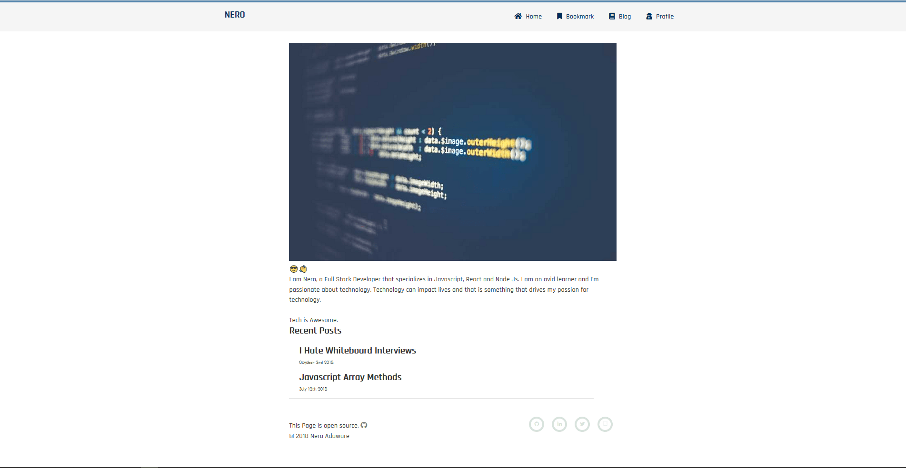
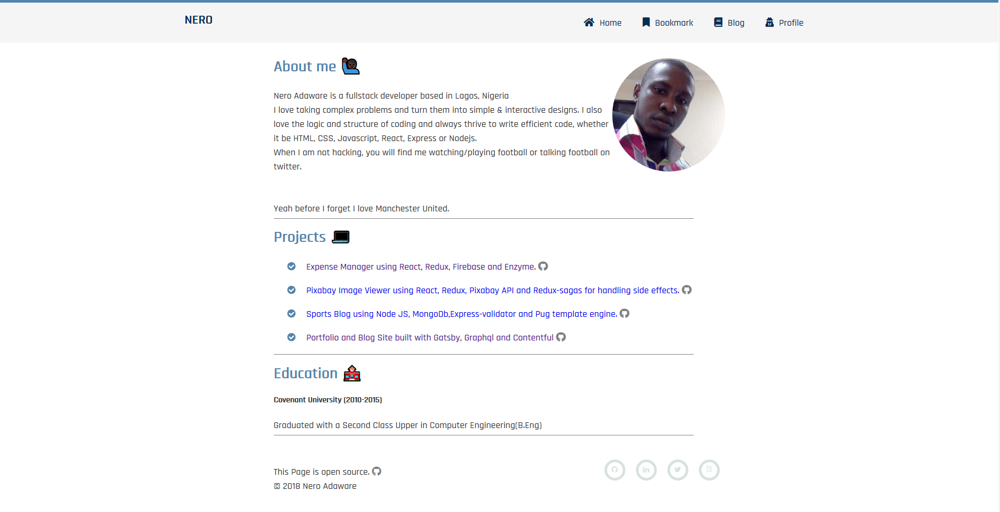

## Gatsby is Awesome

In this article I will be talking about some of Gatsby's awesome features, how they helped me learn React and my personal website.

#### What is Gatsby js?

Gatsby is simply a static site framework built on top of React. It is similar to other static site generators like Hugo, Jekkyl, Nextjs, Nuxtjs e.t.c. If you don't know what a static site generator is then it is a framework or library that generates the HTML, CSS and javascript files at build time. Gatsby is also excellent in building web applications because you get to enjoy the benefits of a static site like speed(blazing fast) and also be able to build dynamic websites.
[Gatsby for web applications ](https://www.gatsbyjs.org/blog/2018-11-07-gatsby-for-apps/)

#### What interested me in Gatsby

Less than Two years ago I started out my journey to learn how to code, after 6-8 months of learning Javascript and React, I felt I needed a portfolio/personal website where I could showcase my side projects and also show my ability to build a website, I first considered building it with React but it was overkill and I needed a backend in case I needed to start blogging, so I continued my search, looking at different developers personal sites trying to figure out which technology they used to build it and there was one that caught my eye(honestly I can't remember the dev's name/website...my bad) it was simple and at the bottom I saw "built with Jekkyl", After a google search that was when I first heard of a static site generator.
What is a static site generator? I asked myself, You know the rabbit hole of google searches you can get into as a developer looking for answers, I never really understood what static site generators were at that point but I ran into Gatsby and the best thing about it was that it was built on React so I had a chance to hone my React skills while learning a need technology and still try to figure out what static site generators are.

The documentation is one of the best amongst all the libraries and frameworks I have used, it provided a starter pack that really helped me understand how it worked and it gave me a working Gatsby application to build upon. That time I used the Gatsby-blog-starter built by Kyle Matthews(himself, I think).

That is the homepage of my first Gatsby portfolio/blog.

The design wasn't the best in the world but it was working. I learned a lot building the project, for the first time I used a CMS(content management system), it also gave me a basic understanding of Graphql while I was able to improve my understanding of React. I used styled-components for components for the styling and contentful as my CMS.

#### Rebuilding my portfolio site

When Gatsby v2 came out I decided to rebuild/redesign my portfolio, which was 2 months after I finished my portfolio site. I updated some API's that changed in v2, ditched styled-components for SCSS and contentful for markdown. I made it responsive but I could do much about the design because I was still terrible at designing.

Well, I started getting a lot of interviews for my first developer job so I didn't have time for work on my portfolio site. My terrible/not-so-terrible portfolio helped me a lot in my interviews(newbies in this coding journey, if you can try to build a portfolio, it doesn't have to be beautiful and it helps showcase your mini/side projects to prospective employers. And if you can use Gatsby because it is awesome) and I was lucky enough to get my first developer job in November 2018. Fast forward four months later I decided I should do a proper redesign of my portfolio because My design skills had improved a bit(still terrible though) and I had written a couple of blog posts that I wanted to publish. I made a Figma sketch of how I wanted it to like then I started building. While building with Gatsby I notice some of its strength that I did like to talk about.

#### Datasource(Source plugins)

Gatsby supports data from almost anywhere you can think of CMS(contentful, wordpress, netlify CMS), Markdown, Api's, local sources e.t.c. The only time Gatsby confused me was when I had to pick a data source for my blogs, I had multiple options available to me that I had to deal with decision fatigue, at the end of the day I just went with markdown because... I don't know I just had to make a choice. The best thing is that integrating a data source is as easy as `npm install whatever-data-source` or `yarn add my-favorite-datasource` and add the configuration to your `gatsby-config.js`. I used markdown so I added the `gatsby-source-filesystem` plugin because it is used to source data from your local file system(local computer). The `gatsby-source-filesystem` plugin can source files like images, markdown, JSON e.t.c. At this point, Gatsby is aware of the data but this raw data needs to be transformed into what can be used by the website. Gatsby again provides a seamless way of doing this through Transformer Plugins.

#### Transformer Plugins.

Yeah like transformers that change from a normal car to an Autobot that is like what transformer plugins do, transform raw data from source plugins to usable data by your website through Graphql queries. Since I was using markdown, all I had to do was `npm install gatsby-transformer-remark` or `yarn add gatsby-transformer-remark` and then add `gatsby-transformer-remark` to the array of plugins in the `gatsby-config.js`. Now all my blog posts are available via a graphql query.

#### Graphql

Most people I know that have used graphql know it's awesome. I haven't used graphql outside Gatsby but I love the fact that data is available on demand. Gatsby v2 also added the `StaticQuery` API to the normal `graphql` tag to help make graphql queries in Components.

#### Routing

Routing in Gatsby is built on top of [Reach router](https://reach.tech/router) but you don't need to add any configuration to use the router and define a route. Defining a route in Gatsby is as simple as creating `name-of-route.js` file in the page folder in your Gatsby application, so the name of that file is the route i.e `blogs.js` produces a `/blogs` route. In my application, I have five routes currently.

#### Plugins I used in my site.

Gatsby has a plugin for almost anything you need for your website. I call it WordPress for developers because it has a lot of plugins. apart from the source plugins(gatsby-source-filesystem) I used for sourcing my data I also used some other plugins created by Gatsby and the community.

- `@weknow/gatsby-remark-codepen`: I added this plugin to my personal website so I could embed codepens in my markdown.

- `@weknow/gatsby-remark-twitter`: I used this so I could embed tweets in my markdown.

- `gatsby-plugin-sass`: Sass/Scss is like my go-to technology for my styling needs so this plugin enables me use Sass in my application.

- `gatsby-remark-prismjs`: This plugin provides code/syntax highlighting in my markdown using Prismjs.

- `gatsby-plugin-offline`: This plugin makes my website work offline when used alongside the `gatsby-plugin-manifest` plugin.

- `gatsby-plugin-robots-txt`: This plugin helps in generating a `robot.txt`, which help with your SEO(Search engine optimization) by telling web engines/search engines which page to crawl.

These are some of the plugins I use for my site. This just shows you one of Gatsby's strengths, that is you are only a plugin away from almost any feature your want.

I know y'all are wondering what my new personal site looks like but it isn't as terrible as the first design(i think). you can check it out

[Personal website](https://finallynero.dev)

These are some of the reasons I love gatsby and also it helped me learn React and Javascript.
