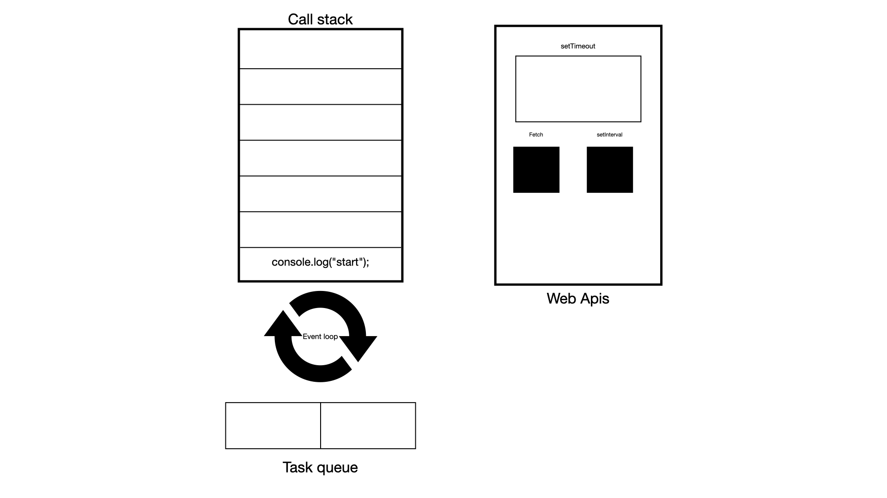

Is Javascript single-threaded? Yes, Javascript is single-threaded. But how does javascript handle expensive operations without blocking the only thread available? In this article we will be looking at how Javascript is single-threaded and how it handles asynchronous operations.

#### Table of contents
- [Introduction](#introduction)
- [Javascript is single-threaded](#javascript-is-single-threaded)
- [Asynchronous and synchronous operations in Javascript](#asynchronous-operations-in-javascript)
  - [Synchronous operations](#synchronous-operations)
  - [Asynchronous operations](#asynchronous-operations)
  - [Event loop](#event-loop)
  - [Callback functions](#callback-functions)
  - [Examples of Settimeout and callback functions](#examples-of-settimeout-and-callback-functions)
- [Conclusion](#conclusion)

### Introduction

Ok, as you have probably heard multiple times, Javascript is single-threaded. But what does that mean? Javascript being single-threaded means that it can execute one piece of code until it is done before moving on to the next line of code.

```javascript
let x = 9;
let y = 10;

let sum = x + y;

console.log(sum);

let division = y/x;

console.log(division);

```
Each line is executed in a sequential order until the end of the function. With this definition of single-threaded, how is it even possible to build complex applications in javascript?

Javascript does not provide a way to pause the execution of code and run another piece or provide a way to spawn multiple threads to handle multiple operations like other programming languages. So how does javascript handle long-running, indeterminate, expensive operations like network requests or reading data from the hard disk without blocking the execution of the code?

### Asynchronous and synchronous operations in Javascript

To understand how javascript is single-threaded we need to understand the difference between synchronous and asynchronous operations.

Synchorous operations are operations that are executed in sequence, one after the other. These are blocking operations which means that the code waits for the operation to complete before moving on to the next line of code. 
The above example is an example of synchronous operations. x variable is assigned a value of 9, then y is assigned a value of 10, then the sum of x and y is calculated and then the division of y by x is calculated. Each line is executed before the next line is executed.
For a simple operations like the above where data is quickly available, synchronous operations are fine. x and y are read from the CPU's memory which is fast and the operations are completed quickly.

Issues arise when we have long-running, indeterminate , expensive operations(network requests or request data from the hard disk) that can block the execution of the code. This is not ideal in javascript because javascript is single-threaded and blocking operations can make the application unresponsive until the operation is completed. On the browser this can make the user interface unresponsive until the operation is completed. In node, this can make the server unresponsive and unable to handle other requests until the operation is completed. This is where asynchronous operations come in.

Asynchronous operations are operations that are not executed in the order they it is written in the code. 

Asynchronous operations enable the code to continue executing while waiting for the expensive long-running operation to complete. Javascript's approach to handling asynchronous operations is to use event loop, task queue , callback functions and promises. We will be looking at these concepts in the next sections.

Before we dive into the event loop, task queue, callback functions and promises, let's look at an example of synchronous and asynchronous operations in javascript.

```javascript

const fs = require('fs');

console.log("start");

//long while loop
for (let i = 0; i < 1000000000; i++) {
    //do nothing
}

console.log("Ended reading file");

```

In the above example, console.log("start") is executed first, then the for loop is executed and then console.log("Ended reading file") is executed. The for loop in this case is to simulate a long-running operation. The code waits for the for loop to complete before moving on to the next line of code. This can make the application unresponsive until the for loop is completed.
Ideally we would want other parts of the application to continue responding to user input and computations while waiting for the expensive operation to complete. This is where asynchronous operations come in.

We can refactor the above code to use asynchronous operations.

```javascript

const fs = require('fs');

console.log("start");

// read file from the hard disk asynchronously
fs.readFile('file.txt', (err, data) => { 
    console.log("Ended reading file");
});

console.log("End");

```

We can also use async/await to handle the asynchronous operation. Async/await is a modern way to handle asynchronous operations in javascript and it makes the code look synchronous even though it is asynchronous.

```javascript

const fs = require('fs').promises;

async function readFileAsync() {
    console.log("start");

    // read file from the hard disk asynchronously
    const data = await fs.readFile('file.txt', 'utf8');
    console.log("Ended reading file");

    console.log("End");
}

readFileAsync();

```

Both the callback and async/await versions achieve the same result - they allow the code to continue executing while waiting for the file to be read from the hard disk. The async/await version is more readable and easier to reason about.

The asynchronous version of the code does not wait for the file to be read from the hard disk before moving on to the next line of code. The code continues executing while waiting for the file to be read from the hard disk. First console.log("start") is executed, then the code read the file from the disk is started and then console.log("End") is executed. When the file has been completely read from disk the console.log("Ended reading file") is executed. In this version , we make use of the callback function to handle the result of the file read operation. The callback function is executed when the file has been read from the disk.

If javascript is single-threaded how is it able to execute long running operations in a non-blocking(without blocking the "only" JS thread). To understand how this is still possible in jAvascript we need to understand the earlier mentioned concepts of call stack, event loop, task queue, callback functions and promises.


### Simplified Javascript runtime

The javascript runtime has some components that helps it manage the execution of code. Some of these components are the heap , call stack, event loop, task queue, callback functions, promises and more. But for the purpose of this article we will be focusing on the heap , call stack, event loop, task queue and callback functions.

Visual representation of the javascript runtime



### Call Stack

The call stack is a data structure in the javascript runtime that is used to keep track functions that are called and in what order they are to be executed. This is javascript's mechanism for managing execution of functions in its single thread, ensuring that functions are excuted to completion before they are popped off the stack. And it operates in a LIFO, Last In First Out. This means that when a function is called it is added to the top of the call stack and any function that is called within that function is added to the top of the call stack. When the inner function is done executing it is removed from the call stack and the next function in the call stack is executed. This continues until the call stack is empty.

Lets look at a simple average function that calculates the average of two numbers and how it is executed in the call stack.

```javascript

function add(x, y) {
    return x + y;
}

function divide(x, y) {
    return x / y;
}

function average (x, y) {
    const sum = add(x, y);
    const a = divide(sum, 2);
    return a;
}

average();

```

<video src="/videos/callst.mp4" width="100%" controls></video> 

In the above example the average function is called and added to the call stack. The average functions starts to execute and the add function is called and added to the call stack. The add function is executed and removed from the call stack. At this point control is returned to the average function and the divide function is called and added to the call stack. The divide function is executed and removed from the call stack. The average function is done executing and removed from the call stack. The call stack is empty again and the program is done executing.

### Task queue

When you perform an async operation in javascript you usually provide a callback function that is executed when the async operation is done. Or in modern javascript you can use promises to handle the result of the async operation. 

Example of async operation with callback function

```javascript

console.log("start");

setTimeout(() => {
    console.log("End");
}, 2000);

console.log("End of program");

```

The first parameter of the setTimeout function is a callback function that is executed after 2000 milliseconds. In the execution of the above code the setTimeout function doesn't pause the execution of the code and wait for the 2000 milliseconds to elapse before moving on to the next line of code. This defies the non-blocking nature of javascript. So how does javascript handle this?

This is where the task queue comes in to play. The setTimeout function is defined by web apis on the browser or in node in a non-browser enviroment.When setTimeout is called the browser offloads the setTimeout function to another thread to handle the 2000 milliseconds delay. When the 2000 milliseconds elapses the callback function is added to the task queue by the browser and then executed.

```javascript

console.log("start");

setTimeout(() => {
    console.log("End");
}, 0);

console.log("End of program");


```

In the above example you would expect the console.log("End) to be executed before the console.log("End of program") because the setTimeout function is set to 0 seconds. But that is not the case. The setTimeout function is offloaded to another thread by the browser and the callback function is added to the task queue. 
But the callback function is not executed until the call stack is empty and that only happens after the console.log("End of program") is executed. This is because the task queue has a lower priority than the call stack. The call stack is always emptied before the task queue is emptied. 

The task queue is a data structure that holds tasks that are ready to be executed. When you perform an asynchronous operation like a network request in javascript, that operation does not run on the main thread. Instead the operation is offloaded to another thread in the browser or in the node runtime. When the operation is done, in other to notify the main thread that the operation is done, the callback function you provided is added to the task queue. Eventually the event loop will move the callback function from the task queue to the call stack , then the callback function is executed and finally removed from the call stack.


The call stack, event loop and task queue effectively work together to make javascript non-blocking on a single thread. There are two types of task queues in javascript, the microtask queue and the macrotask queue. We wont be going into the details of the microtask queue and the macrotask queue in this article. But it is important to know that the microtask queue has a higher priority than the macrotask queue. This means that the microtask queue is emptied before the macrotask queue is emptied.

### Event loop

Finally we have the event loop which is a mechanism that enables javascript to be non-blocking and handle asynchorous operations in a single-threaded environment. Unlike other programming languages that can spawn multiple threads to handle multiple operations, javascript is single-threaded and can only execute one piece of code at a time. 
The way the event loop supports non-blocking operations is by being like a traffic warden that directs the flow of code execution. Coordinating code execution between the call stack and the task queues. The event loop checks the call stack and the task queue. If the call stack is empty, the event loop checks the task queue for any tasks that are ready to be executed. If there are tasks in the task queue, the event loop moves the tasks from the task queue to the call stack for execution. This is how javascript is able to handle asynchronous operations without blocking the single thread.

Representation of the order of execution of sync and async operations in simplified javascript runtime

<video src="/videos/runtime.mp4" width="100%" controls></video> 


### Conclusion

I know we have claimed throughout this article that javascript is single threaded but it is not entirely true. Javascript is single-threaded in the sense that it can only execute one piece of code at a time and until completion. 
But javascript can offload expensive operations to another thread and then handle the result of the operation when it is done.

In this article we explored how javascript runtime is able to handle asynchronous operations in a single-threaded environment. Other programming languages usually handle async operations by multi-threading but this can be complex and error-prone if not implemented correctly. Javascript chose to handle async operations in a way that looks synchronous and is easy to reason about. The event loop, task queue, callback functions and promises are some of the mechanisms that javascript uses to handle async operations. Understanding these concepts will help you write better javascript code and build better applications.


