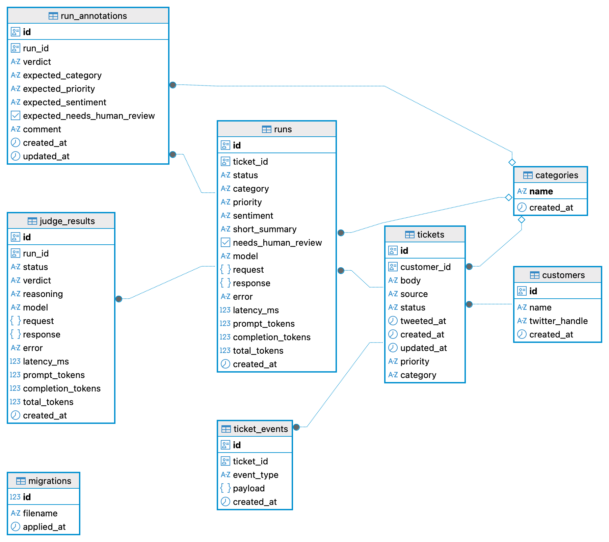

# Case Study: PiggyVest Support Triage Agent Part 2
In this part I discuss the decisions made in building the Support Triage Agent platform.

I initially approached this problem by having a tickets table with columns like ai_category, ai_priority, ai_status etc. But AI applications require a different approach. 

In order to build a robust AI application I must be thinking around designing the boundaries around the AI, ensuring I can get the model to make a decision that is correct and trustworthy.
To achieve this I need to structure the model domain data in a way that I can have multiple runs and review so I can finetune and evaluate until I get a good result. 

## Model design decisions

With this in mind AI runs and results will be stored in a separate runs table. This allows a single ticket to have multiple runs and the runs table contains details about the runs, tokens used, decision made, failure, latency, etc. Information will be stored in a structured way so I can query and analyze the data. I also keep failed runs for observability, debugging and evaluation.

Evaluation is critical to any AI application, so I wanted it built in from the start. The model needs an anchor to guide its decision. One of these anchors is human gold standard review. I built a way for a human to annotate each ticket, and each annotation becomes ground truth I use to evaluate and fine-tune the model later. Because this lives in the AI application, I can query the data, A/B test models, and calculate accuracy, TP, FP, and FN rates.
This data will be stored in the runs_annotations table, a human provides the expected category, priority, needs_human_review flag etc.

### Storage Diagram

The AI output is only stored for evaluation purposes, it never writes into the ticket table, because until the evals prove the model works, I won't let it touch the source of truth.
In upcoming parts I will cover the evaluation process and how I can use the data to fine-tune and evaluate the model.

This AI application can be built with a UI, server and storage technologies. In this project I have a conventional layered Node/PostgreSQL app (routes, services, repositories).
My stack for this is Node/PostgreSQL, Express, Docker, OpenAI, React, Tailwind, Vite.
Link to the code is below:

[Case Study: Support Triage Agent](https://github.com/nero2009/support-ops)

