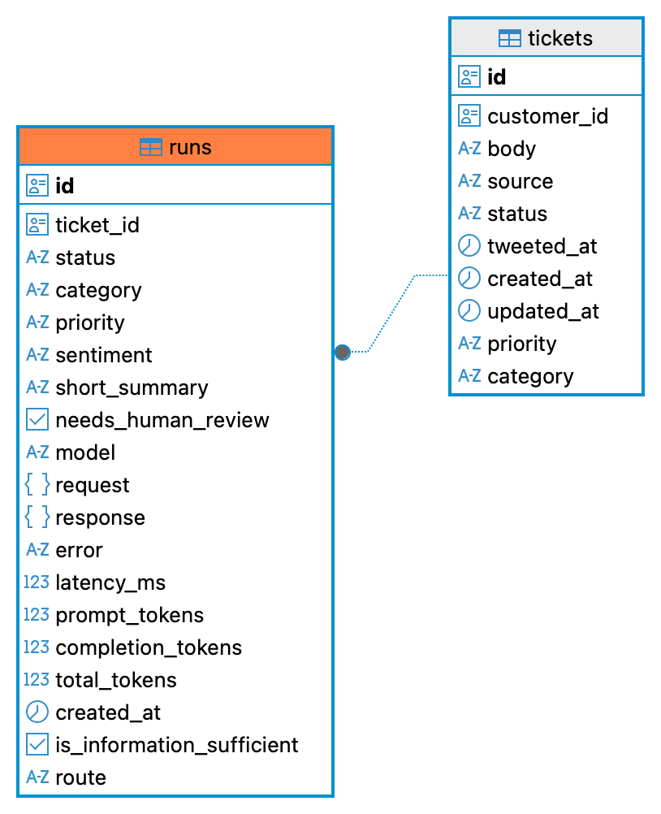
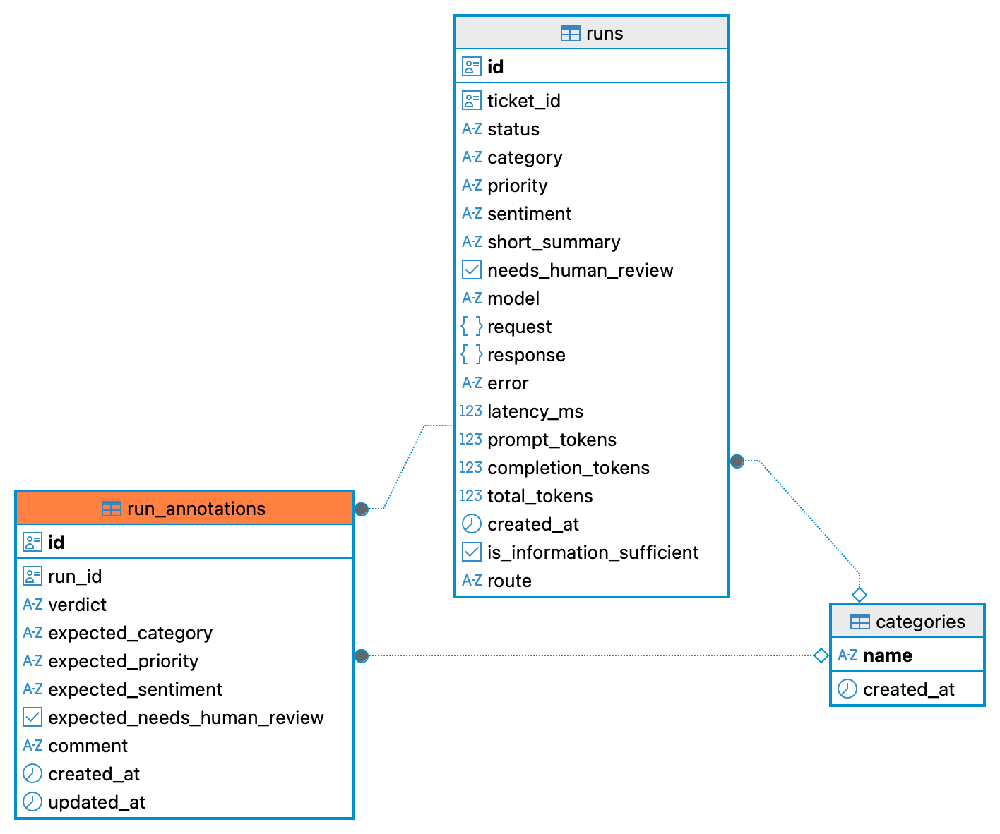
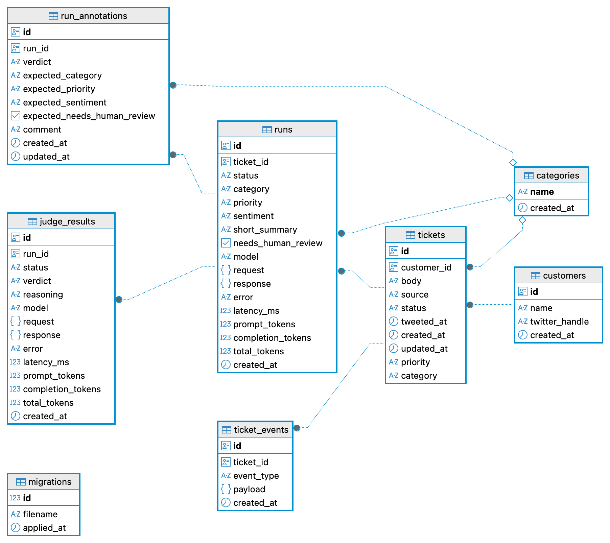

# Case Study: PiggyVest Support Triage Agent Part 2
In this part I discuss the decisions made in building the Support Triage Agent platform.

## What the platform does

A customer support request enters the platform as a Ticket. A human support agent can trigger AI triage, which returns structured suggestions such as category, priority and whether human review is required. Each execution is stored as a Run, including its output, latency, token usage and failures. A human can review a Run and record corrections as an Annotation.
Later, we will have the AI application retrieve information from FAQs and knowledge-base articles which agent can use as context to generate a reply. We will also allow HITL(Human in the loop) to review sensitive tickets.

## Designing boundaries around the AI

My initial instinct was to add fields such as `ai_category`, `ai_priority`, and `ai_status` to the Tickets table. That works for deterministic application state, but model output can change between executions, fail, and must be evaluated before it becomes trusted business state.
I therefore store each AI execution as a separate Run. A Ticket can have many Runs, allowing me to preserve history, compare prompt and model versions, investigate failures, measure latency and token usage Information will be stored in a structured way so I can query and analyze the data. I also keep failed runs for observability, debugging and evaluation.



Evaluation is critical to any AI application, so I wanted it built in from the start. I built a way for a human reviewer to annotate each Run. The annotation records gold standard values for category, priority, sentiment and needs_human_review. I store these human labels in the run_annotations table and use them as ground truth when evaluating the model. 




### Storage Diagram




### Tables of interest:

```
Ticket
  └── many Runs
        └── zero or one editable human Annotation per Run
```

- `tickets`: contains the customer support requests. source of truth, AI will not write to this table.
- `runs`: AI output, details about the runs, tokens used etc. Important for evaluation and tracing.
- `run_annotations`: Stores a human review of a Run. Each Run can have one editable annotation containing corrected values that serve as ground truth during evaluation.

For now, AI output is stored as a suggestion and evaluation trace. It does not update the Ticket, which remains the source of truth. AI-generated replies, write-back and automatic escalation will require separate decisions after the system has been evaluated.

In upcoming parts I will cover how to get structured output from the model, the evaluation process and how I can use the data to evaluate the model.

This AI application can be built with any UI, server and storage technologies. In this project I have a conventional layered Node/PostgreSQL app (routes, services, repositories).
My stack for this is Node/PostgreSQL, Express, Docker, OpenAI, React, Tailwind, Vite.
Link to the code is below:

[Case Study: Support Triage Agent](https://github.com/nero2009/support-ops)


